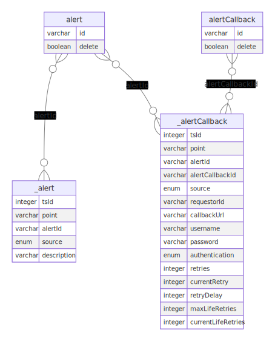

# MNI CRUD Concepts

The data required for MNI must be expanded overtime during normal operations as MNI requires a historical dataset in order to predict the future changes, this requires certain adjustments to normal Create-Read-Update-Delete (CRUD) concepts in addition to all non-administrative datasets including metadata fields:

1. `point` a timestamp (specific point in time)
2. `source` to indicate if either supplied as actual (`historical`), supplied as proposed (`planned`), or generated (`predicted`) internally via machine learning predictive algorithms
3. `delete` to indicate if marked for deletion

All records, regardless of type, are subject to the administrative data pruning mechanisms when the historical retention period ( HTTP GET `/mni/v1/admin/data/historical/duration`)  of the record has been exceeded 

### Shadow Time-Series Tables

Each data (parent) table has a corresponding shadow (child) table prefixed by _, for example Alerts are held in the database table alert and its shadow table is _alert.

The parent table only consists of two fields:

- Unique Identifier (UUIDv4) as the primary key
- delete

The child table consist of at least three fields before the real fields are included:

- `tsId` an auto-populated integer based sequential Identifier (sequence) as the primary key
- `point` to hold the timestamp
- `source`
- Additional identifier (UUIDv4) as the referential key(s) value to link back to the parent table(s) primary key

In entity relationship terms, this looks like:

Time-Series Shadow Tables

Any other table that requires to have referential integrity will include the necessary identifier in the child table but referencing the parent table. This allows all held data to be held as time-based versions which reflects the creation, modification and deleting that occurs over normal operation time. In entity relationship terms, this looks like:

Primary and Foreign Relationships

### Bulk Create (Import)

- dataset presented via API will include point values
- dataset presented via API will optionally include internal identifiers (UUID)
- dataset (JSON array) will be unpackaged into individual records
- If the request is invalid, HTTP status code 400 will be returned
- For non-administrative datasets:
  - When record is stored, the metadata fields are automatically populated with:
    - `point` - extracted from supplied dataset record
    - `source` - extracted from supplied dataset record
    - `delete` - extracted from supplied dataset record
- For all datasets:
  - the internal identifiers (UUID), created if not supplied or used if supplied
- HTTP status code 200 will be returned

### Bulk Read (Export)

- if no such record(s) exists, HTTP status code 404 will be returned
- If the request is invalid, HTTP status code 400 will be returned
- All held records value will be packaged as dataset (JSON array) including all internally held identifiers (UUID) and for non-administrative datasets the metadata fields will be included:
  - point field value (date format in compressed ISO-8601. YYYYMMDDThhmmss)
  - source field value (string enum)
  - delete field value (boolean)
- HTTP status code 200 will be returned

### Create

- record presented via API will NOT include point value
- If the request is invalid, HTTP status code 400 will be returned
- When record is stored, two metadata fields are automatically populated with:
  - `point` = current system date/time
  - `source` = historical
  - `delete` = false
- the internal identifier (UUID) will be returned along with HTTP status code 200

### Read

- if no such record(s) exists, HTTP status code 404 will be returned
- If the request is invalid, HTTP status code 400 will be returned
- if no point value or range is requested via API query parameters then the latest historical record(s) (i.e. state = historical) will be returned with HTTP status code 200
- If point value or is requested via API query parameter that extends into the future, record(s) with either a source of historical or predicted and not marked for deletion (i.e.delete = false) will be returned with HTTP status code 200

### Update

- If specified record does not exist then HTTP status code 404 will be returned
- If specified record exists but is marked for deletion (delete = true) then HTTP status code 404 will be returned
- If the request is invalid, HTTP status code 400 will be returned
- The existing record is **NOT** updated or altered in any fashion
- If a partial update (HTTP PATCH) then:
  - the existing record is read, the update applied but the resulting record stored as a new record with the metadata fields automatically populated with:
    - `point` = current system date/time
    - `source` = historical
    - `delete` = false
  - HTTP status code 204 will be returned
- If a full update (HTTP PUT) then:
  - the supplied record stored as a new record with the metadata fields automatically populated as:
    - `point` = current system date/time
    - `source` = historical
    - `delete` = false
  - HTTP status code 204 will be returned

### Delete

- If specified record does not exist then HTTP status code 404 will be returned
- If the request is invalid, HTTP status code 400 will be returned
- The existing record is **NOT** deleted but the existing record is read, but the resulting record stored as a new record with the two metadata fields automatically populated with:
  - `point` = current system date/time
  - `source` - as per existing record value
  - `delete` =  true
- HTTP status code 204 will be returned